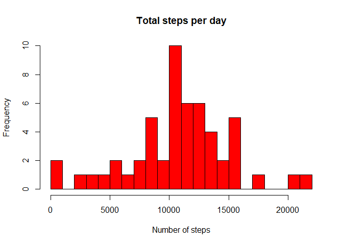
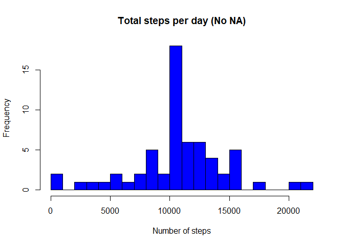
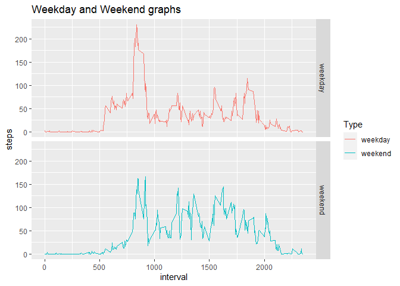

## Necessary Libraries and global echo setting true


```r
knitr::opts_chunk$set(echo = T)
library(dplyr)
```

```
## 
## Attaching package: 'dplyr'
```

```
## The following objects are masked from 'package:stats':
## 
##     filter, lag
```

```
## The following objects are masked from 'package:base':
## 
##     intersect, setdiff, setequal, union
```

```r
library(ggplot2)
```

## Loading and preprocessing the data


```r
unzip("activity.zip")
rawdata <- read.csv("activity.csv", header = T)
```

## What is mean total number of steps taken per day?


```r
datanoNA <- na.omit(rawdata) ## removing NA values

steps.day <- group_by(datanoNA, date)
steps.day <- summarize(steps.day, steps = sum(steps))

hist(steps.day$steps, main = "Total steps per day", xlab = "Number of steps", breaks = 20, col = "red")
```

<!-- -->

```r
datanoNA_mean <- mean(steps.day$steps)

datanoNA_median <- median(steps.day$steps)
```

## What is the average daily activity pattern?


```r
stepsinterval <- datanoNA %>% select(interval, steps) %>% 
    group_by(interval) %>% summarize(steps = mean(steps))


ggplot(stepsinterval, aes(x=interval, y=steps))+ geom_line()
```

<!-- -->

```r
stepsinterval[which.max(stepsinterval$average)]
```

```
## Warning: Unknown or uninitialised column: `average`.
```

```
## # A tibble: 288 x 0
```

## Imputing missing values


```r
## number of missing values is equal to the difference in the number 
## of rows between the raw data set and the sub-data set 
## that has the missing values removed

nrow(rawdata) - nrow(datanoNA)
```

```
## [1] 2304
```

```r
## New data set with no missing values by replacing NAs with interval averages from other days

imputeNA <- rawdata %>%
  mutate(steps = case_when(
      is.na(steps) ~ stepsinterval$steps[match(rawdata$interval, stepsinterval$interval)],      
      TRUE ~ as.numeric(steps)
    ))

## New histogram containing the imputed values

impute_total <- imputeNA %>% group_by(date) %>% summarize(steps = sum(steps))

hist(impute_total$steps, main = "Total steps per day (No NA)",xlab = "Number of steps", breaks = 20, col = "blue")
```

<!-- -->

```r
## New mean and median values for the complete set

imputeNA_mean <- mean(impute_total$steps)
imputeNA_median <- median(impute_total$steps)

## Difference between mean and median of the original set 
## and the set with filled missing values

meandiff <- imputeNA_mean - datanoNA_mean
mediandiff <- imputeNA_median - datanoNA_median
```


## Are there differences in activity patterns between weekdays and weekends?


```r
## Separating weekdays from weekends

imputeNA$Date <- as.Date(imputeNA$date, format = "%Y-%m-%d")
imputeNA$weekday <- weekdays(imputeNA$Date)
imputeNA$Type <- ifelse(imputeNA$weekday == 'Saturday' | imputeNA$weekday == 'Sunday',
                        'weekend', 'weekday')

## Last plot depicting activity in weekdays and weekends

imputedaytype <- aggregate(steps~interval+Type,data=imputeNA,FUN=mean,na.action=na.omit)
ggplot(imputedaytype, aes(interval, steps, colour = Type)) + geom_line() + ggtitle("Weekday and Weekend graphs") + facet_grid(Type ~ .) 
```

<!-- -->
